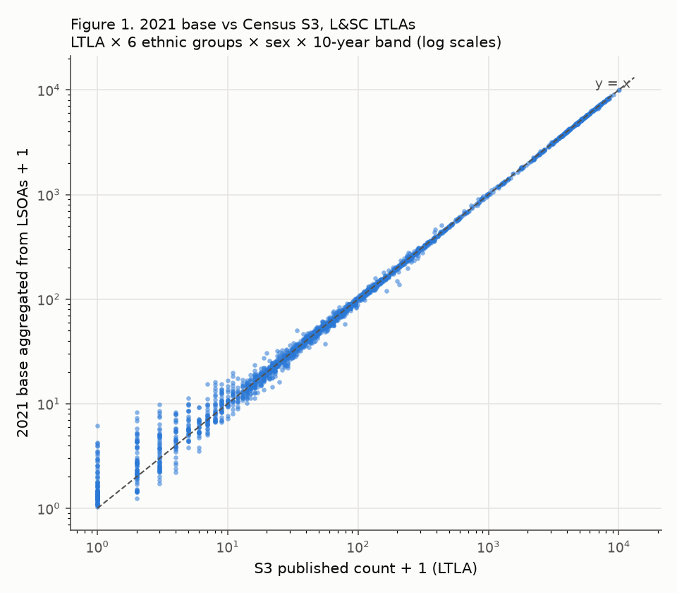
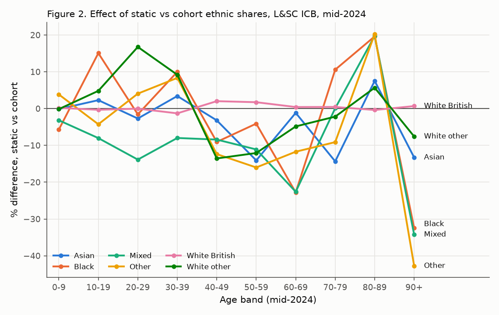
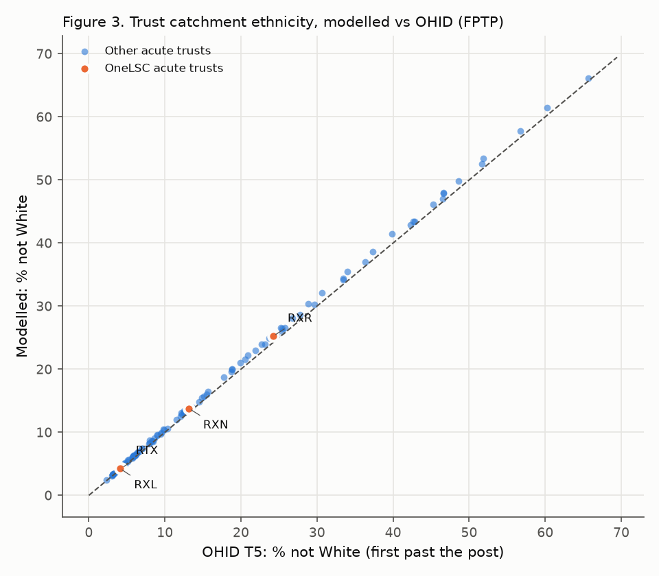

# Validation report

> **Generated file.** Rendered by `lsc-pop docs` from the latest complete run's `validation.jsonl` and comparison CSVs. Don't edit by hand. Terms: [glossary](glossary.md). Hard checks stop the pipeline when they fail; soft and informational checks are reported only.

Run `20261002T155325Z_d1033f90_6cc3e8e2`: **67 checks; 48 hard, 0 hard failures; 1 soft warnings.**

## Brief §10 checklist

| Check | Result | Evidence |
|---|---|---|
| Footprint LSOA count matches the lookup; no duplicates; every LSOA has ICB/sub-ICB/LA/IoD | ✅ pass | `GEO-01`, `GEO-02`, `GEO-03`, `GEO-04`, `DEP-01`, `OUT-02` |
| RM032 'Does not apply' = 0 for all LSOAs | ✅ pass | `CEN-01`, `CEN-07-age_91a` |
| Margin reconciliation adjustments within tolerance (distribution logged) | ✅ pass (soft warning) | `CEN-09`, `CEN-10`, `CEN-12` |
| 2021 base reproduces RM032 and RM200 margins within IPF tolerance | ✅ pass | `BAS-01`, `BAS-02` |
| 2021 base ethnic totals vs TS021 (differences reported) | ✅ pass | `BAS-05` |
| 2021 base aggregated to LA vs LA ethnicity × age × sex (reported + chart) | ✅ pass | `BAS-06` |
| Mid-year output sums exactly to S5 for every LSOA × sex × age | ✅ pass | `ROL-05` |
| No negative/NaN values; shares in [0, 1] and summing to 1 | ✅ pass | `BAS-07`, `CEN-11`, `ROL-06`, `ROL-07` |
| Aggregates reconcile to constituent LSOAs; trust totals compared with OHID | ✅ pass | `OUT-03`, `OUT-04`, `CAT-07`, `CAT-08` |
| Cohort vs static differences summarised by ethnic group and age | reported | [`sensitivity.md`](sensitivity.md), Figure 2 |
| Re-running from a clean checkout reproduces identical output hashes | ✅ identical | 20261001T224131Z_e30e42c2 vs 20261001T225222Z_e30e42c2 (clean checkout: fresh copy, uv sync, download, run) (6 tables) |

## All checks

| ID | Stage | Type | Result | Description | Key metrics |
|---|---|---|---|---|---|
| GEO-01 | geography | hard | ✅ | NHS and Census lookups cover the same England LSOAs | {"only_census": 0, "only_nhs": 0} |
| GEO-02 | geography | hard | ✅ | England LSOA count matches expected | {"expected": 33755, "lsoas": 33755} |
| GEO-03 | geography | hard | ✅ | LSOA codes unique | {"duplicates": 0} |
| GEO-04 | geography | hard | ✅ | Every LSOA has MSOA, LTLA21, region, LAD, sub-ICB, ICB and NHS region | {"blank_cells": {}} |
| GEO-05 | geography | hard | ✅ | sicbl_cd nests within icb_cd | {"examples": [], "violations": 0} |
| GEO-06 | geography | hard | ✅ | icb_cd nests within nhser_cd | {"examples": [], "violations": 0} |
| GEO-07 | geography | hard | ✅ | msoa21cd nests within ltla21cd | {"examples": [], "violations": 0} |
| GEO-08 | geography | hard | ✅ | ltla21cd nests within lad_cd | {"examples": [], "violations": 0} |
| GEO-09 | geography | hard | ✅ | ltla21cd nests within rgn21cd | {"examples": [], "violations": 0} |
| GEO-10 | geography | soft/info | ✅ | LADs split across ICBs (informational) | {"examples": ["E06000060", "E06000063", "E06000064", "E06000065", "E07000180"], "lads_split": 5} |
| GEO-11 | geography | hard | ✅ | Footprint is non-empty | {"footprint_lsoas": 33755, "mode": "england"} |
| GEO-12 | geography | soft/info | ✅ | Focus ICB(s) summary (informational) | {"lads": 17, "lsoas": 1060, "ltla21s": 18, "msoa21s": 216, "sicbls": 8} |
| CEN-01 | census | hard | ✅ | RM032 'Does not apply' = 0 (all-groups total = sum of 19 groups) | {"cells_nonzero": 0, "total_minus_sum": 0} |
| CEN-02 | census | hard | ✅ | RM032 covers exactly the lookup LSOAs with a complete, unique grid | {"expected_rows": 6413450, "extra_lsoas": 0, "missing_lsoas": 0, "rows": 6413450} |
| CEN-02b | census | hard | ✅ | RM032 counts are non-negative integers |  |
| CEN-03 | census | hard | ✅ | RM200 all-ages total = sum of single years | {"cells_nonzero": 0} |
| CEN-04 | census | hard | ✅ | RM200 covers exactly the lookup LSOAs with a complete, unique grid | {"expected_rows": 6143410, "extra_lsoas": 0, "missing_lsoas": 0, "rows": 6143410} |
| CEN-04b | census | hard | ✅ | RM200 counts are non-negative integers |  |
| CEN-05 | census | hard | ✅ | TS021 total = sum of 19 groups | {"lsoas_nonzero": 0} |
| CEN-06 | census | hard | ✅ | TS021 covers exactly the lookup LSOAs with a complete, unique grid | {"expected_rows": 641345, "extra_lsoas": 0, "missing_lsoas": 0, "rows": 641345} |
| CEN-06b | census | hard | ✅ | TS021 counts are non-negative integers |  |
| CEN-07-age_91a | census | hard | ✅ | S3 age_91a: 'Does not apply' = 0 | {"total": 0} |
| CEN-08-age_91a | census | hard | ✅ | S3 age_91a: requested areas = lookup LTLAs; returned + blocked = requested | {"blocked": ["E06000053", "E07000026", "E07000029", "E07000030", "E07000046", "E07000047", "E07000166", "E07000167"], "requested": 309, "returned": 301} |
| CEN-07-age_23a | census | hard | ✅ | S3 age_23a: 'Does not apply' = 0 | {"total": 0} |
| CEN-08-age_23a | census | hard | ✅ | S3 age_23a: requested areas = lookup LTLAs; returned + blocked = requested | {"blocked": ["E06000053"], "requested": 309, "returned": 308} |
| CEN-09 | census | soft/info | ✅ | Cross-table discrepancies (informational) | {"band_zero_inconsistency": {"persons_rm032_zero_rm200_pos": 0, "persons_rm200_zero_rm032_pos": 0, "rm032_zero_rm200_pos": 0, "rm200_zero_rm032_pos": 0}, "focus_rm032_vs_rm200_lsoa_sex_band": {"cells": 10600, "max_abs":  … |
| CEN-10 | census | hard | ✅ | Reconciled ethnic and age margins agree on every LSOA x sex x band total | {"max_gap": 2.2737367544323206e-13} |
| CEN-11 | census | hard | ✅ | Reconciled margins non-negative and finite |  |
| CEN-12 | census | soft/info | ⚠️ | Band-total adjustment within max(10 persons, 5%) (soft) | {"bands": 337550, "bands_age_fallback": 0, "bands_eth_fallback": 0, "bands_flagged": 153, "examples": [["E01000123", "M", "4"], ["E01000158", "F", "4"], ["E01000469", "M", "1"], ["E01000479", "F", "1"], ["E01000534", "M" … |
| BAS-01 | base | hard | ✅ | Base reproduces reconciled RM032 (eth × sex × band) within IPF tolerance | {"max_abs": 8.788811953763798e-07} |
| BAS-02 | base | hard | ✅ | Base reproduces RM200 (sex × single year) within IPF tolerance | {"max_abs": 2.2737367544323206e-13} |
| BAS-03 | base | hard | ✅ | Base total = reconciled margin total (RM200) | {"base_total": 56489042.0, "rm200_total": 56489042.0} |
| BAS-07 | base | hard | ✅ | Base non-negative and finite |  |
| BAS-04 | base | soft/info | ✅ | Base vs raw RM032 (differences = reconciliation; informational) | {"cells": 6413450, "max_abs": 13.836257309941516, "mean_abs": 0.108, "net": -1530.9999999997442, "p50_abs": 0.0, "p95_abs": 0.45312499999999645, "p99_abs": 2.7108433734939865, "share_identical": 0.5705} |
| BAS-05 | base | soft/info | ✅ | Base vs TS021 ethnic totals (perturbation differences; informational) | {"england_eth": {"1": {"base": 629451.7, "diff": -164.3, "ts021": 629616.0}, "2": {"base": 431028.4, "diff": -160.6, "ts021": 431189.0}, "3": {"base": 1843346.9, "diff": 187.9, "ts021": 1843159.0}, "4": {"base": 1570249. … |
| BAS-06 | base | soft/info | ✅ | Base aggregated to LTLA vs S3 eth × sex × single year (informational) | {"all": {"cells": 1040858, "max_abs": 324.44412777219895, "max_rel": 1.8598, "mean_abs": 1.002, "net": -849.9999999995975, "p50_abs": 0.31396253436600247, "p95_abs": 4.062560307206894, "p95_rel": 0.381, "p99_abs": 12.644 … |
| BAS-08 | base | soft/info | ✅ | IPF converged for every table (iterations by band) | {"1": {"iter_max": 18, "iter_p50": 4.0, "iter_p95": 6.0, "max_col_error": 1.1368683772161603e-13, "max_row_error": 4.0757778663191857e-07, "tables": 67510}, "2": {"iter_max": 24, "iter_p50": 4.0, "iter_p95": 5.0, "max_co … |
| BAS-09 | base | soft/info | ✅ | Seed-floor sensitivity, focus ICB (informational) | {"rows": [{"mae_vs_seed_ltla_cell": 1.349296784829091, "max_abs_cell_diff_vs_default": 2.720733186493171, "max_share_diff_vs_default": 0.5507028105265332, "rmse_vs_seed_ltla_cell": 15.502182159009994, "total_abs_diff_vs_ … |
| ROL-01 | rollforward | hard | ✅ | Mid-year estimates cover exactly the lookup LSOAs | {"extra": 0, "missing": 0, "rows": 33755} |
| ROL-02 | rollforward | hard | ✅ | Mid-year Total = sum of sex x single-year cells | {"lsoas_nonzero": 0} |
| ROL-03 | rollforward | hard | ✅ | Mid-year cells are non-negative integers |  |
| ROL-04 | rollforward | soft/info | ✅ | S5 single-year file agrees with accredited broad-age S5b | {"max_abs_diff": 0.0} |
| ROL-05 | rollforward | hard | ✅ | [cohort] Estimates sum to S5 for every LSOA x sex x age | {"max_abs_gap": 2.2737367544323206e-13} |
| ROL-06 | rollforward | hard | ✅ | [cohort] Shares finite, in [0, 1] and sum to 1 | {"max_sum_err": 6.661338147750939e-16} |
| ROL-07 | rollforward | hard | ✅ | [cohort] Estimates non-negative/finite; total = S5 total | {"s5_total": 58620101.0, "total": 58620101.0} |
| ROL-08 | rollforward | soft/info | ✅ | [cohort] Share fallback usage (informational) | {"direct": {"cells": 6054215, "persons": 58489072.0}, "lsoa_all": {"cells": 0, "persons": 0.0}, "lsoa_sex_all_ages": {"cells": 23, "persons": 7.0}, "lsoa_sex_band": {"cells": 89172, "persons": 131022.0}, "ltla_sex_age":  … |
| DEP-01 | deprivation | hard | ✅ | IoD covers exactly the lookup LSOAs (1:1) | {"missing": 0, "rows": 33755} |
| DEP-02 | deprivation | hard | ✅ | IMD ranks are a permutation of 1..N and deciles are 1..10 |  |
| DEP-03 | deprivation | soft/info | ✅ | Local IMD quintiles hold ~20% of each ICB's population (soft: |share-20%| <= 5pp) | {"max_abs_deviation": 0.003080934444731509} |
| DEP-04 | deprivation | soft/info | ✅ | Core20 population share (informational) | {"england": 0.20281652192990934, "focus_icb": 0.2960356763435323} |
| CAT-01 | catchments | hard | ✅ | OHID MSOAs = lookup MSOAs (MSOA 2021, England) | {"lookup": 6856, "missing": 0, "ohid": 6856} |
| CAT-02 | catchments | hard | ✅ | One OHID row per MSOA x trust |  |
| CAT-03 | catchments | hard | ✅ | Published proportions per MSOA sum to <= 1 | {"max": 0.997, "mean": 0.9776550466744457, "min": 0.881} |
| CAT-04 | catchments | soft/info | ✅ | Exactly one first-past-the-post trust per MSOA | {"msoas_not_one": 0} |
| CAT-05 | catchments | hard | ✅ | Bridge proportions sum to 1 per LSOA (published incl. UNASSIGNED; rescaled) | {"lsoas": 33755, "max_err": 2.220446049250313e-16} |
| CAT-06 | catchments | hard | ✅ | Every bridge trust is in dim_trust; every focus trust is present | {"focus_missing": [], "missing_in_dim": []} |
| CAT-07 | catchments | hard | ✅ | Σ trusts (published) + UNASSIGNED = total population (reconciles) | {"population": 58620101.0, "rescaled_total": 58620101.0, "trusts_plus_unassigned": 58620101.0, "unassigned": 1301102.1819999993} |
| CAT-08 | catchments | soft/info | ✅ | Trust totals vs OHID T1 (informational; OHID uses mid-2022 populations) | {"all_pct_rescaled_vs_ohid": {"25%": 1.56, "50%": 3.78, "75%": 5.39, "count": 134.0, "max": 33.82, "mean": 1.93, "min": -54.49, "std": 9.87}, "focus": [{"modelled_published": 296555.8, "modelled_rescaled": 302786.3, "ohi … |
| CAT-09 | catchments | soft/info | ✅ | Trust 5-group ethnicity vs OHID T5, both selection methods (informational) | {"focus": [{"diff_pp_A": -1.87, "diff_pp_B": -0.08, "diff_pp_M": -0.13, "diff_pp_O": -0.04, "diff_pp_W": 2.12, "selection_method": "All (5% and above)", "trust_code": "RTX"}, {"diff_pp_A": -6.54, "diff_pp_B": -0.3, "diff … |
| CAT-10 | catchments | soft/info | ✅ | Trust mean IMD 2025 score vs OHID T6 (informational) | {"focus": [{"diff": 0.05, "modelled_imd_score": 20.05, "ohid_imd_score": 20.0, "trust_code": "RTX"}, {"diff": 0.86, "modelled_imd_score": 30.76, "ohid_imd_score": 29.9, "trust_code": "RXL"}, {"diff": -0.13, "modelled_imd … |
| CAT-11 | catchments | soft/info | ✅ | Diagnostic: which geography's ethnic mix best reproduces OHID 'All (5% and above)' (informational) | {"best_level": "icb_cd", "best_mean_abs_diff_pp": 1.9, "lsoa_mean_abs_diff_pp": 2.47} |
| OUT-01 | outputs | hard | ✅ | Referential integrity of the star schema | {"bridge.lsoa in dim_lsoa": true, "bridge.trust in dim_trust": true, "dim_lsoa unique": true, "fact.age in dim_age": true, "fact.eth19 in dim_ethnicity": true, "fact.lsoa in dim_lsoa": true} |
| OUT-02 | outputs | hard | ✅ | dim_lsoa has no missing values (every LSOA has geography and IoD) | {"missing_cells": 0} |
| OUT-03 | outputs | hard | ✅ | ICB totals from fact = sum of dim_lsoa populations | {"icbs": 36, "max_abs_gap": 0.0} |
| OUT-04 | outputs | hard | ✅ | Σ over trusts incl. UNASSIGNED = England total | {"population": 58620101.0, "trust_total": 58620101.0} |
| OUT-05 | outputs | hard | ✅ | fact CSVs (one per ICB) cover every fact row exactly once | {"files": 36, "rows": 116724790} |
| OUT-06 | outputs | soft/info | ✅ | Output data hashes recorded (compare across runs for reproducibility) | {"bridge_lsoa_trust": "e25b5fad9d4bacab9bedd7192681cc303c69c89430c9ed297688f02929eed1b4", "dim_age": "3e20cb14f4b9674d74fafb6475097f84bf904e2d9b784caa6a76e397e6e371a8", "dim_ethnicity": "ea6de4ae4013510b8d073a2210dd9bf2b … |

## Key comparisons

### 2021 base vs TS021, England ethnic totals

| eth19 | group | base | diff | ts021 | % diff |
|---|---|---|---|---|---|
| 1 | Asian, Asian British or Asian Welsh: Bangladeshi | 629,451.7 | -164.3 | 629,616.0 | -0.03 |
| 2 | Asian, Asian British or Asian Welsh: Chinese | 431,028.4 | -160.6 | 431,189.0 | -0.04 |
| 3 | Asian, Asian British or Asian Welsh: Indian | 1,843,346.9 | 187.9 | 1,843,159.0 | 0.01 |
| 4 | Asian, Asian British or Asian Welsh: Pakistani | 1,570,249.2 | -9.80 | 1,570,259.0 | -0.00 |
| 5 | Asian, Asian British or Asian Welsh: Other Asian | 951,765.7 | -509.3 | 952,275.0 | -0.05 |
| 6 | Black, Black British, Black Welsh, Caribbean or African: African | 1,468,573.8 | 90.80 | 1,468,483.0 | 0.01 |
| 7 | Black, Black British, Black Welsh, Caribbean or African: Caribbean | 619,328.0 | -90.00 | 619,418.0 | -0.01 |
| 8 | Black, Black British, Black Welsh, Caribbean or African: Other Black | 293,884.9 | 115.9 | 293,769.0 | 0.04 |
| 9 | Mixed or Multiple ethnic groups: White and Asian | 473,934.6 | -127.4 | 474,062.0 | -0.03 |
| 10 | Mixed or Multiple ethnic groups: White and Black African | 241,476.3 | -53.70 | 241,530.0 | -0.02 |
| 11 | Mixed or Multiple ethnic groups: White and Black Caribbean | 498,841.7 | -437.3 | 499,279.0 | -0.09 |
| 12 | Mixed or Multiple ethnic groups: Other Mixed or Multiple ethnic groups | 453,924.8 | -508.2 | 454,433.0 | -0.11 |
| 13 | White: English, Welsh, Scottish, Northern Irish or British | 41,542,025.4 | 1,093.4 | 41,540,932.0 | 0.00 |
| 14 | White: Irish | 493,969.1 | -390.9 | 494,360.0 | -0.08 |
| 15 | White: Gypsy or Irish Traveller | 64,085.9 | -128.1 | 64,214.0 | -0.20 |
| 16 | White: Roma | 98,993.2 | -108.8 | 99,102.0 | -0.11 |
| 17 | White: Other White | 3,585,096.4 | 82.40 | 3,585,014.0 | 0.00 |
| 18 | Other ethnic group: Arab | 320,024.9 | -125.1 | 320,150.0 | -0.04 |
| 19 | Other ethnic group: Any other ethnic group | 909,041.4 | 177.4 | 908,864.0 | 0.02 |

Differences come from independent perturbation of RM032/RM200/TS021 and from reconciling to RM200 totals (ADR-0015). They aren't model error.

### 2021 base vs S3 (LTLA × sex × ethnic group × single year)

`BAS-06`: {"all": {"cells": 1040858, "max_abs": 324.44412777219895, "max_rel": 1.8598, "mean_abs": 1.002, "net": -849.9999999995975, "p50_abs": 0.31396253436600247, "p95_abs": 4.062560307206894, "p95_rel": 0.381, "p99_abs": 12.644 …

### Trust catchment totals vs OHID T1 (focus trusts + RBN)

| trust_code | modelled_published | modelled_rescaled | ohid_t1_mye2022 | pct_published_vs_ohid | pct_rescaled_vs_ohid |
|---|---|---|---|---|---|
| RBN | 592,952.1 | 601,150.1 | 578962 | 2.42 | 3.83 |
| RTX | 296,555.8 | 302,786.3 | 303740 | -2.37 | -0.31 |
| RXL | 303,969.2 | 308,816.8 | 299904 | 1.36 | 2.97 |
| RXN | 483,164.3 | 491,481.8 | 470448 | 2.70 | 4.47 |
| RXR | 473,895.9 | 483,067.9 | 455538 | 4.03 | 6.04 |

### Trust 5-group ethnicity vs OHID T5 (focus trusts + RBN)

| trust_code | selection_method | modelled_pct_A | modelled_pct_B | modelled_pct_M | modelled_pct_O | modelled_pct_W | ohid_pct_A | ohid_pct_B | ohid_pct_M | ohid_pct_W | ohid_pct_O |
|---|---|---|---|---|---|---|---|---|---|---|---|
| RBN | All (5% and above) | 1.78 | 0.64 | 1.62 | 0.67 | 95.29 | 3.96 | 1.26 | 1.88 | 91.75 | 1.15 |
| RTX | All (5% and above) | 1.97 | 0.52 | 1.25 | 0.57 | 95.68 | 3.84 | 0.60 | 1.38 | 93.56 | 0.61 |
| RXL | All (5% and above) | 1.96 | 0.41 | 1.50 | 0.51 | 95.61 | 8.50 | 0.71 | 1.52 | 88.53 | 0.74 |
| RXN | All (5% and above) | 8.91 | 1.08 | 2.13 | 0.92 | 86.96 | 8.80 | 1.13 | 1.61 | 87.61 | 0.85 |
| RXR | All (5% and above) | 22.70 | 0.48 | 1.70 | 0.95 | 74.17 | 10.76 | 1.33 | 1.74 | 85.23 | 0.94 |
| RBN | First past the post | 1.57 | 0.55 | 1.56 | 0.59 | 95.74 | 1.54 | 0.53 | 1.44 | 95.92 | 0.56 |
| RTX | First past the post | 1.97 | 0.51 | 1.25 | 0.57 | 95.70 | 2.07 | 0.51 | 1.15 | 95.71 | 0.56 |
| RXL | First past the post | 1.88 | 0.41 | 1.49 | 0.50 | 95.72 | 1.81 | 0.40 | 1.38 | 95.93 | 0.48 |
| RXN | First past the post | 9.21 | 1.25 | 2.32 | 1.00 | 86.22 | 8.85 | 1.21 | 2.11 | 86.85 | 0.97 |
| RXR | First past the post | 22.15 | 0.47 | 1.69 | 0.93 | 74.75 | 21.34 | 0.47 | 1.54 | 75.75 | 0.90 |

### Trust mean IMD 2025 score vs OHID T6 (focus trusts + RBN)

| trust_code | modelled_imd_score | ohid_imd_score | diff |
|---|---|---|---|
| RBN | 26.70 | 26.70 | 0.00 |
| RTX | 20.05 | 20.00 | 0.05 |
| RXL | 30.76 | 29.90 | 0.86 |
| RXN | 21.57 | 21.70 | -0.13 |
| RXR | 33.74 | 33.20 | 0.54 |

Notes on the OHID comparison:
- OHID T1 totals use **mid-2022** populations, so modelled mid-2024 totals are expected to be somewhat higher. `modelled_published` excludes the ~2% suppressed remainder (`UNASSIGNED`) and `modelled_rescaled` includes it (ADR-0019).
- Under OHID's **first-past-the-post** method, modelled 5-group percentages agree closely (median absolute difference about 0.1 percentage points across all trusts).
- Under OHID's **'All (5% and above)'** method they do **not** agree well for some trusts (e.g. RXL Asian 2.0% modelled vs 8.5% OHID), while the mean IMD score computed with the same weighting matches OHID's T6 closely. OHID's exact ethnicity method for that table isn't published, so this difference is **unexplained**. We don't treat it as evidence for or against the model.

### Why OHID's 'All (5% and above)' ethnicity can't be reproduced (CAT-11)

Hypothesis test, regenerated every run. For each candidate geography, each LSOA's ethnic mix is replaced by the mix of its whole MSOA / LTLA / upper-tier LA / sub-ICB / ICB / NHS region. Trust percentages are then recomputed with OHID's 5%-threshold, share-weighted method and compared with OHID T5 across the 128 trusts it covers (5 groups).

| ethnic_mix_level | trusts | mean_abs_diff_pp | median_abs_diff_pp | RXL_pct_A | RXL_ohid_pct_A | RXR_pct_A | RXR_ohid_pct_A | RXN_pct_A | RXN_ohid_pct_A | RTX_pct_A | RTX_ohid_pct_A |
|---|---|---|---|---|---|---|---|---|---|---|---|
| lsoa21cd | 128 | 2.47 | 0.91 | 1.96 | 8.50 | 22.70 | 10.76 | 8.91 | 8.80 | 1.97 | 3.84 |
| msoa21cd | 128 | 2.47 | 0.91 | 1.96 | 8.50 | 22.70 | 10.76 | 8.91 | 8.80 | 1.97 | 3.84 |
| ltla21cd | 128 | 2.29 | 0.92 | 1.98 | 8.50 | 21.28 | 10.76 | 9.13 | 8.80 | 2.00 | 3.84 |
| utla21cd | 128 | 2.24 | 0.85 | 5.85 | 8.50 | 16.69 | 10.76 | 8.83 | 8.80 | 4.37 | 3.84 |
| sicbl_cd | 128 | 2.11 | 0.80 | 2.00 | 8.50 | 21.48 | 10.76 | 9.15 | 8.80 | 2.08 | 3.84 |
| icb_cd | 128 | 1.90 | 0.68 | 9.75 | 8.50 | 9.77 | 10.76 | 9.77 | 8.80 | 9.67 | 3.84 |
| nhser_cd | 128 | 2.63 | 1.22 | 9.07 | 8.50 | 9.07 | 10.76 | 9.07 | 8.80 | 9.04 | 3.84 |

Reading: using our own LSOA mix gives the *largest* error. Smoothing the mix over large areas brings the figures closer to OHID (ICB best overall), but **no single geography reproduces OHID**. ICB averaging explains the central Lancashire trusts (RXL, RXR, RXN ≈ the L&SC average) but not Morecambe Bay (RTX). Meanwhile OHID's **first-past-the-post** ethnicity, built from the same MSOA ethnicity, matches ours to about 0.1 pp, and its T6 IMD (same 5% weighting) matches to within 1 point. So the inputs agree, and the difference lies in how OHID aggregated this one table. OHID doesn't publish the method. We treat it as **not comparable** and validate against FPTP instead (ADR-0019).

### Cohort vs static (sensitivity)

### Trust ethnicity vs OHID (first past the post)

